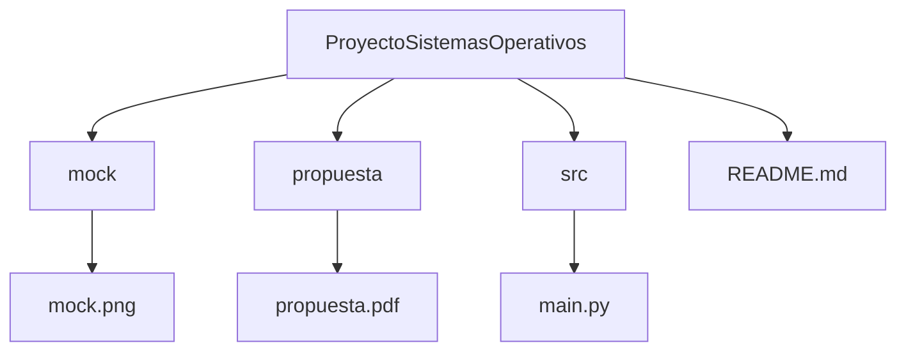

# Simulador de turnos en una fila.

##  1. Nombre del Equipo e Integrantes
* **Nombre del Equipo:** 
* **Integrantes:**
    * Samuel Suarez Jaramillo
    * Juan Camilo Agudelo Arias
    * Emmanuel Cardona Llanos

##  2. Nombre y Modalidad del Proyecto
* **Nombre:** Simulador de turnos en una fila.
* **Modalidad:** Base.

##  3. Descripción Breve
Este proyecto consiste en un simulador en consola que representa una fila de atención utilizando el principio de First In, Fisrt Out. Esl sistema permite ingresar personas con su tiempo de atención, simular el orden en que son atendidas y calcular métricas como el tiempo de espera y el tiempo total en el sistema. Se busca mas que nada comprender el orden de llegada que influye en los tiempos de atención dentro de un proceso secuencial. 

## 4. Arquitectura de Módulos

##  5. Alcances
* **E1**
**1. crear personas (Nombre, tiempo de atención)**
**2. Simular orden FIFO**
**3.Calcular:**
- Tiempo de espera
- Tiempo total en el sistema
- Promedios

* **E2**
- Ingresar las personas a gusto
- Agregar opción de prioridad como adultos mayores, niños, personas con discapacidad, etc.
- Validaciones de entrada

* **E3**
- Interfaz mejorada para guardar resultados en archivo
- Se agrega un simulador de SJF para organizar las prioridades de atención.

# 6. Alcances por Entrega

## Entrega 1 – Funcionalidad Básica

### Funciona

1. Creación de personas ingresando:
   - Nombre  
   - Tiempo de atención  
2. Simulación del algoritmo FIFO.
3. Cálculo automático de:
   - Tiempo de espera por persona  
   - Tiempo total en el sistema  
   - Promedio de tiempo de espera  
   - Promedio de tiempo total  
4. Representación básica del orden de atención en consola (tipo Gantt simple).

### No incluye aún
- Sistema de prioridades  
- Validaciones avanzadas  
- Otros algoritmos de planificación  
- Guardado de resultados en archivo

## Entrega 2 – Mejora de Entrada y Prioridades

### Funciona

1. Ingreso libre de personas (el usuario decide cuántas agregar).
2. Validaciones básicas:
   - Que el tiempo de atención sea numérico.
   - Que no se permitan valores negativos.
   - Que el nombre no esté vacío.
3. Opción de prioridad:
   - Adulto mayor  
   - Niño  
   - Persona con discapacidad  
   - Usuario normal  

El sistema reorganiza la fila respetando el nivel de prioridad antes de ejecutar la simulación.

### No incluye aún
- Comparación entre algoritmos  
- Guardado automático en archivo  
- Simulador SJF  

## Entrega 3 – Extensión del Proyecto

### Funciona

1. Interfaz de consola mejorada:
   - Menú interactivo
   - Opción para repetir simulaciones
   - Opción para guardar resultados en archivo `.txt`
   - 
2. Implementación del algoritmo **SJF (Shortest Job First)**.
3. Comparación entre:
   - FIFO  
   - SJF  
4. Visualización de métricas comparativas:
   - Promedio de espera por algoritmo  
   - Promedio de tiempo total  

## Resultado Final del Proyecto

El sistema permite analizar cómo distintos métodos de organización (FIFO y SJF) afectan los tiempos de espera y retorno en una fila de atención, permitiendo comparar su eficiencia dentro de un entorno simulado en consola.

