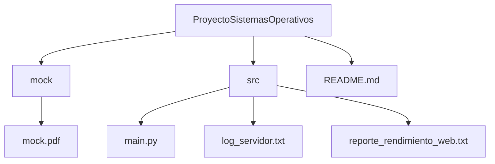

# Simulador de Turnos en una Fila - HTTP Server Load Simulator

## 1. Nombre del Equipo e Integrantes
* **Nombre del Equipo:** (Ingresa aquí el nombre de tu equipo)
* **Integrantes:**
    * Samuel Suarez Jaramillo
    * Juan Camilo Agudelo Arias
    * Emmanuel Cardona Llanos

## 2. Nombre y Modalidad del Proyecto
* **Nombre:** Simulador de turnos en una fila (Gestión de Hilos, RAM/SWAP y Latencia de Peticiones).
* **Modalidad:** Proyecto Base (Evolucionado a simulación de concurrencia en SO).

## 3. Descripción Breve
Este proyecto consiste en un simulador académico de consola que representa el comportamiento de un balanceador de carga y un servidor web procesando peticiones concurrentes. El sistema demuestra de forma práctica cómo los **Sistemas Operativos** gestionan la multiprogramación, la asignación de memoria física (RAM) frente a la memoria virtual (SWAP), la planificación de la CPU (estrategias FIFO y SJF) y el uso de mecanismos de sincronización para evitar condiciones de carrera en secciones críticas.

---


### 1. Aplicación Real de Conceptos de SO & Simulación 
El simulador modela rigurosamente los estados de transición de los procesos y la gestión de memoria de un sistema operativo real:
* **Planificación FIFO:** Procesa los hilos secuencialmente respetando el orden de llegada a la cola.
* **Planificación SJF:** Optimiza el orden basándose en la carga de CPU (ciclos de procesamiento) para minimizar el tiempo de espera promedio.
* **Gestión de Memoria Virtual:** Si una petición sobrepasa la `MEMORIA_RAM_TOTAL` (1000MB), el SO emula una paginación derivando el hilo a **SWAP (Disco)**, penalizando su velocidad de ejecución debido a la alta latencia del almacenamiento secundario.

### 2. Procesos Reales y Concurrencia 
* El sistema genera un **Worker Thread independiente** (`threading.Thread`) para cada petición HTTP mapeada desde la consola.
* Los hilos se ejecutan de manera concurrente en el procesador, permitiendo visualizar en tiempo real cómo interactúan, se superponen y compiten por los recursos del sistema.

### 3. Sincronización y Sección Crítica 
El acceso a recursos globales compartidos (`memoria_en_uso`, archivo físico de logs y salida estándar `print`) genera potenciales condiciones de carrera (*Race Conditions*). Para resolverlo, se implementaron **Locks de exclusión mutua (Mutex)**:
* **`lock_memoria`**: Garantiza que la verificación y asignación de la RAM sea una operación atómica.
* **`lock_log`**: Evita la corrupción y el entrelazado de cadenas de texto cuando varios hilos escriben concurrentemente en el archivo y en la pantalla.

### 4. Monitoreo y Uso de Recursos 
El programa genera un archivo de salida llamado `reporte_rendimiento_web.txt` que calcula de forma automática:
* Tiempo real de CPU consumido.
* Tiempo de espera en la cola de planificación.
* Tiempo total de retorno del sistema (*Turnaround Time*).
* Análisis comparativo de latencias promedio entre FIFO y SJF.

---

## 4. Arquitectura de Módulos


```mermaid
flowchart TD
    A[ProyectoSistemasOperativos]

    A --> B[mock]
    A --> C[src]
    A --> D[README.md]

    C --> G[main.py]
    C --> H[log_servidor.txt]
    C --> K[reporte_rendimiento_web.txt]
    B --> I[mock.pdf]

```

---

## 5. Alcances por Entrega

### Entrega 1 – Funcionalidad Básica

* **Funciona:**
1. Creación de entidades/personas ingresando ID y tiempo de atención (Ciclos de CPU).
2. Simulación secuencial bajo el principio FIFO.
3. Cálculo básico del tiempo de espera y tiempo total en el sistema.


* **No incluía aún:** Sistema de prioridades por hardware, validaciones controladas de tipos de datos, soporte para múltiples algoritmos de planificación, ni persistencia en disco de reportes.

### Entrega 2 – Mejora de Entrada y Prioridades

* **Funciona:**
1. Ingreso dinámico y libre de solicitudes según lo requiera el usuario.
2. Sanitización y validaciones robustas de entrada (`try-except ValueError`) para evitar desbordamientos o caracteres inválidos en tiempos y memorias.
3. Control por tipos de perfiles/prioridades (Adulto mayor, Niño, Persona con discapacidad, Usuario normal) que alteraban la cola antes del despacho.


### Entrega 3 – Extensión del Proyecto (Resultado Final)

* **Funciona:**
1. Incorporación del modelo de **Gestión de Memoria y Concurrencia** a través de hilos reales del sistema operativo.
2. Implementación completa y funcional del algoritmo **SJF (Shortest Job First)**.
3. Inclusión del entorno de Memoria Virtual (RAM vs SWAP) con penalización de latencia por saturación.
4. Módulo de persistencia que exporta los logs detallados (`log_servidor.txt`) y las métricas analíticas comparativas (`reporte_rendimiento_web.txt`).


---

##  Evidencia de Trazabilidad y Comportamiento del Servidor

A continuación se exponen fragmentos reales extraídos de la ejecución del sistema, donde se observa el comportamiento del planificador, el mapeo de hilos y la administración del pool de memoria:

### Trazabilidad con Gestión de Memoria Activa

---

##  Preparación para la Sustentación Individual 

Cada uno de los integrantes del equipo (Samuel, Juan Camilo y Emmanuel) domina y está en total capacidad de explicar ante el docente los siguientes conceptos clave aplicados en el software:

1. **Hilo vs Proceso:** Explicar por qué las peticiones corren sobre hilos del sistema operativo (`threading.Thread`) compartiendo el mismo espacio de dirección de memoria globales del servidor.
2. **Sección Crítica Real:** Justificar por qué la concurrencia rompería el límite de los `1000MB` si se removieran las directivas `with lock_memoria` al permitir que dos hilos evalúen la condición al mismo tiempo.
3. **Mapeo de Estados:** Identificar en el código la transición desde el estado de *Listo* (llamada al método `.start()`), *Ejecución* (dentro del ciclo `for` de procesamiento de CPU), *Bloqueado/Espera* (`time.sleep`) y *Terminado* (al finalizar la función y liberar los descriptores).

```

```
